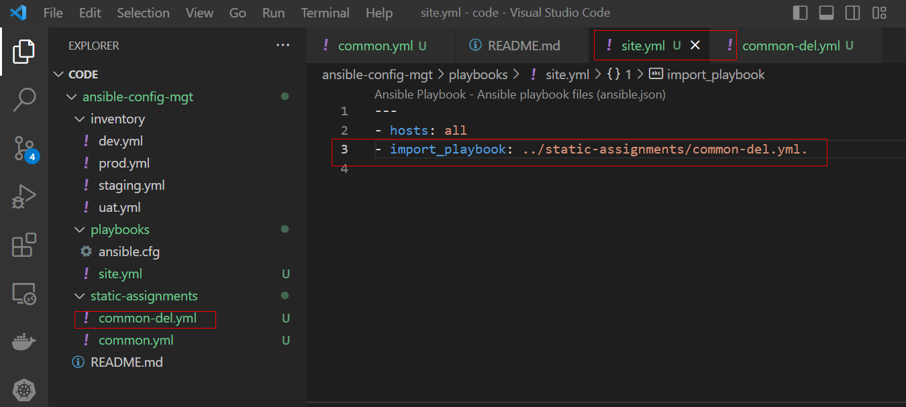
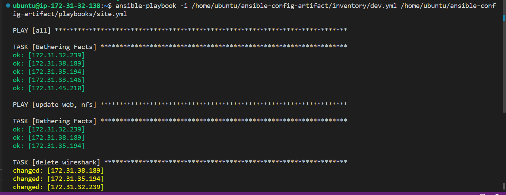
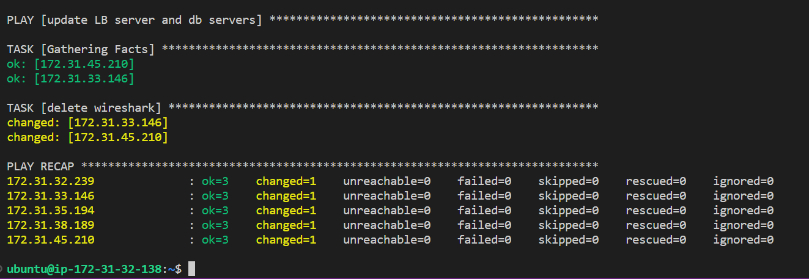
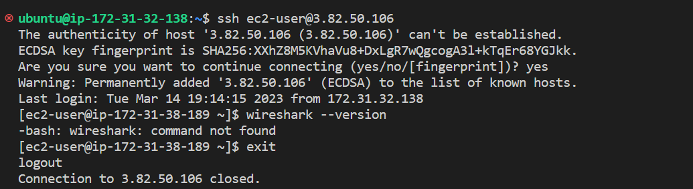

## Ansible Refactoring & Static Assignments (Imports and Roles)

In this project we'll continue working with the *automate-everything* repository and make some improvements of our code.
Here, we need to refactor our Ansible code, create assignments, and learn how to use the imports functionality. Imports allow to effectively re-use previously created playbooks in a new playbook - it allows us to organize our tasks and reuse them when needed.

### Jenkins Job Amelioration
First, let's make some changes to our Jenkins job - before now, every new change in the codes creates a separate directory, which truthfully, is not very convenient when we want to run some commands from one place. Besides, it saps the space on the Jenkins server with every subsequent change. Let's ameliorate this, by introducing a new Jenkins project/job, we'll also require `Copy Artifact plugin`.

- Proceed to your Jenkins-Ansible server and create a new directory called 'ansible-artifact' - this is where we'll store all artifacts after each build.

`sudo mkdir /home/ubuntu/ansible-artifact`

- Change permissions to this directory, so Jenkins could save files there 

`chmod -R 0777 /home/ubuntu/ansible-artifact`

- Go to Jenkins web console -> Manage Jenkins -> Manage Plugins -> on Available tab search for Copy Artifact and install this plugin without restarting Jenkins

- Create a new Freestyle projecct and name it 'save_artifacts' - This project will be triggered by completion of your existing ansible project. 
Configure it accordingly:


> The goal of the "save_artifacts" project is to save artifacts into `/home/ubuntu/ansible-artifact` directory. In order to achieve this:

- we need to create a Build step and choose Copy artifacts from other project, specify "ansible as a source project" and /home/ubuntu/ansible-artifact as a target directory.
  
- Test your set up by making some change in README.MD file inside your *automate-everything *repository (right inside master branch).

If both Jenkins jobs have completed one after another - you shall see your files inside /home/ubuntu/ansible-artifact directory and it will be updated with every commit to your master branch.


## Refactor Ansible code by importing other playbooks into site.yml

Before starting to refactor the codes, ensure that you have pulled down the latest code from master (main) branch, and created a new branch, name it *refactor*.

In Project 11 we wrote all tasks in a single playbook common.yml, now it is pretty simple set of instructions for only 2 types of OS, but imagine we have many more tasks and you need to apply this playbook to other servers with different requirements. In this case, you will have to read through the whole playbook to check if all tasks written there are applicable and is there anything that you need to add for certain server/OS families. Very fast it will become a tedious exercise and the playbook will become messy with many commented parts. 

Let see code re-use in action by importing other playbooks.

Within playbooks folder, create a new file and name it site.yml - This file will now be considered as an entry point into the entire infrastructure configuration. Other playbooks will be included here as a reference. In other words, `site.yml` - will become a parent to all other playbooks that will be developed. Including common.yml that you created previously.

- Create a new folder in root of the repository and name it static-assignments. The static-assignments folder is where all other children playbooks will be stored. This is merely for easy organization of your work.

- Move *common.yml* file into the newly created static-assignments folder.

- Inside site.yml file, import common.yml playbook.

```
---
- hosts: all
- import_playbook: ../static-assignments/common.yml
```

> The code above uses built in import_playbook Ansible module.

Your folder structure should look like this;

```
├── static-assignments
│   └── common.yml
├── inventory
    └── dev
    └── stage
    └── uat
    └── prod
└── playbooks
    └── site.yml
```


- Run ansible-playbook command against the dev environment
Since you need to apply some tasks to your dev servers and wireshark is already installed - you can go ahead and create another playbook under static-assignments and name it common-del.yml. In this playbook, configure deletion of wireshark utility.

```
---
- name: update web, nfs 
  hosts: webservers, nfs
  remote_user: ec2-user
  become: yes
  become_user: root
  tasks:
  - name: delete wireshark
    yum:
      name: wireshark
      state: removed

- name: update LB server and db servers
  hosts: lb, db
  remote_user: ubuntu
  become: yes
  become_user: root
  tasks:
  - name: delete wireshark
    apt:
      name: wireshark-qt
      state: absent
      autoremove: yes
      purge: yes
      autoclean: yes
```

- update site.yml with - import_playbook: ../static-assignments/common-del.yml instead of common.yml 


- run it against dev servers:

`sudo ansible-playbook -i /home/ubuntu/ansible-config-mgt/inventory/dev.yml /home/ubuntu/ansible-config-mgt/playbooks/site.yaml`





Make sure that wireshark is deleted on all the servers by running wireshark --version


### Configure UAT Webservers with a role ‘Webserver’

We now have our nice and clean dev environment, so let us put it aside and configure 2 new Web Servers as uat. We could write tasks to configure Web Servers in the same playbook, but it would be too messy, instead, we will use a dedicated role to make our configuration reusable.

- Launch 2 fresh EC2 instances using RHEL 8 image, we will use them as our uat servers, so give them names accordingly - Web1-UAT and Web2-UAT.

- To create a role, you must create a directory called roles/, relative to the playbook file or in /etc/ansible/ directory.
There are two ways how you can create this folder structure:

Use an Ansible utility called ansible-galaxy inside ansible-config-mgt/roles directory (you need to create roles directory upfront)

```
mkdir roles
cd roles
ansible-galaxy init webserver
```

- Or you coul create the directory/files structure manually
Note: You can choose either way, but since you store all your codes in GitHub, it is recommended to create folders and files there rather than locally on Jenkins-Ansible server.

The entire folder structure should look like below, but if you create it manually - you can skip creating tests, files, and vars or remove them if you used ansible-galaxy

```
└── webserver
    ├── README.md
    ├── defaults
    │   └── main.yml
    ├── files
    ├── handlers
    │   └── main.yml
    ├── meta
    │   └── main.yml
    ├── tasks
    │   └── main.yml
    ├── templates
    ├── tests
    │   ├── inventory
    │   └── test.yml
    └── vars
        └── main.yml
```

After removing unnecessary directories and files, the roles structure should look like this:

```
└── webserver
    ├── README.md
    ├── defaults
    │   └── main.yml
    ├── handlers
    │   └── main.yml
    ├── meta
    │   └── main.yml
    ├── tasks
    │   └── main.yml
    └── templates
```

- Update your inventory ansible-config-mgt/inventory/uat.yml file with IP addresses of your 2 UAT Web servers:

```
[uat_webservers]
uat-1 ansible_host=<Web1-UAT-Server-Private-IP-Address> ansible_ssh_user='araflyayinde'
uat-2 ansible_host=<Web1-UAT-Server-Private-IP-Address> ansible_ssh_user='araflyayinde'
```

- Run a ping, to see if everything is wired correctly

`$ ansible all -i /home/araflyayinde/ansible-artifact/inventory/uat -m ping`

```
Output

uat-2 | SUCCESS => {
    "ansible_facts": {
        "discovered_interpreter_python": "/usr/libexec/platform-python"
    },
    "changed": false,
    "ping": "pong"
}
uat-1 | SUCCESS => {
    "ansible_facts": {
        "discovered_interpreter_python": "/usr/libexec/platform-python"
    },
    "changed": false,
    "ping": "pong"
}
```